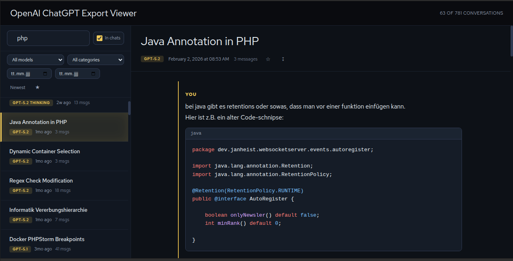

# OpenAI ChatGPT Export Viewer

A fast, local-first viewer for **large ChatGPT exports** — built for high-volume archives split into `conversations-000.json`, `conversations-001.json`, and so on.

<p align="center">
  
</p>

---

## Quick Start

**1. Export your ChatGPT data**

In ChatGPT: **Settings → Data controls → Export data**. You'll receive a download link via email.

**2. Place this viewer inside the export folder**

```
your-chatgpt-export/
├── conversations-000.json
├── conversations-001.json
├── conversations-002.json
├── ...
├── export_manifest.json
├── user.json
├── dalle-generations/
└── chatgpt-export-viewer/   ← this repo
    ├── index.html
    ├── style.css
    ├── app.js
    ├── worker.js
    └── libs/
```

**3. Start a local server**

```bash
cd /path/to/your-chatgpt-export
python3 -m http.server 8000
```

**4. Open the viewer**

```
http://localhost:8000/chatgpt-export-viewer/
```

> Browsers block `fetch()` from `file://` URLs. A local server avoids that and is required for large exports.

---

## Features

- **Handles chunked exports** (`conversations-000.json` → auto-detects the end)
- **Search** by title, or **search inside chats** with the *In chats* toggle
- **Filter** by model, category (gizmo), and date range
- **Sort** newest/oldest and **star** important conversations
- **Export to Markdown**
- **Rich rendering**: Markdown, code blocks with highlighting, math (KaTeX), images, tool calls, and more
- **Virtualized sidebar** for smooth scrolling across thousands of conversations

---

## How It Works

- A **Web Worker** loads all `conversations-xxx.json` files off the main thread.
- It builds a lightweight index (title, date, model, category) for fast filtering.
- Conversations are rendered on demand by walking the message tree.
- Image paths are resolved via `export_manifest.json` when filenames include extra suffixes.
- All third-party libraries are **local** (`/libs`) — no external CDNs.

---

## Notes for Large Exports

- The viewer **expects chunked files** named exactly `conversations-000.json`, `conversations-001.json`, etc.
- Place this repo **one folder below** your export root so `../conversations-000.json` and `../export_manifest.json` are reachable.

---

## Privacy

Your data never leaves your computer. The app runs entirely in your browser and uses only local files from the export directory.

---

## Browser Support

Any modern browser with Web Workers and ES6 support: Chrome, Firefox, Safari, Edge.

---

## License

[MIT](LICENSE)
