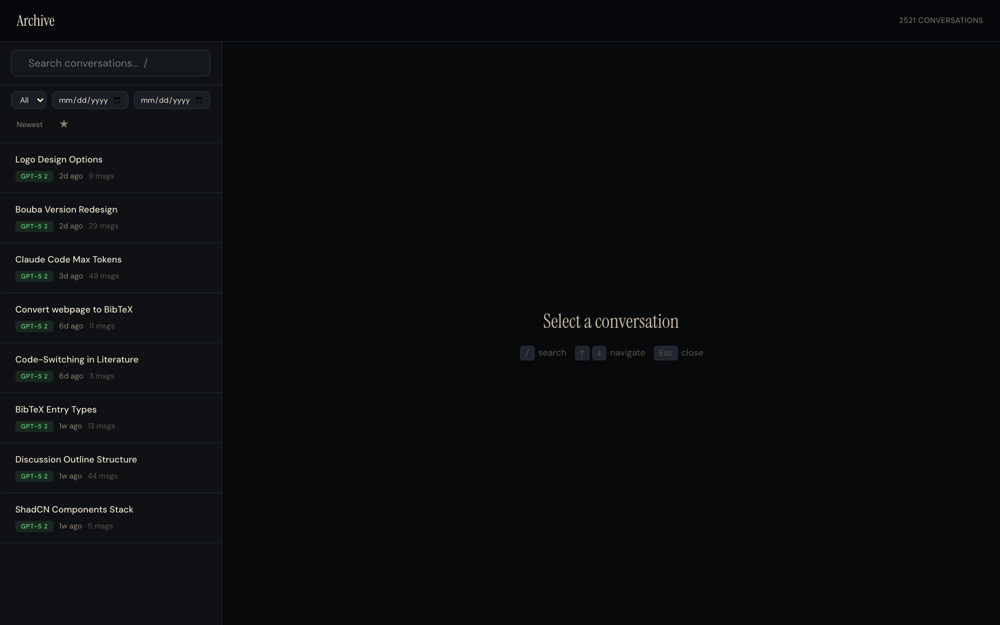
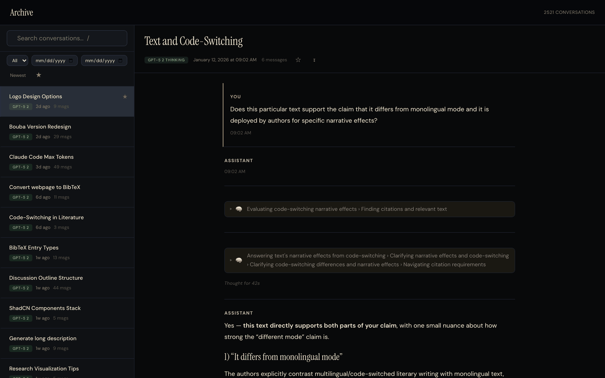

# chatgpt-export-viewer

**A beautiful, local-first conversation viewer for your ChatGPT data export.**

Drop this folder into your export, start a local server, and browse all your conversations in a polished UI — search, filter by model, star favorites, export to Markdown.


<p align="center">
  
</p>

<p align="center">
  
</p>

---

## Quick Start

**1. Export your ChatGPT data**

Go to [ChatGPT Settings → Data controls → Export data](https://chat.openai.com/). You'll receive a download link via email.

**2. Download this viewer**

```bash
# Option A: Clone
git clone https://github.com/YOUR_USERNAME/chatgpt-export-viewer.git

# Option B: Download ZIP from GitHub and extract
```

**3. Place it inside your export folder**

```
your-chatgpt-export/
├── conversations.json      ← Your data (from the export)
├── user.json
├── *.png, *.wav, etc.
└── chatgpt-export-viewer/  ← This repo
    ├── index.html
    ├── style.css
    ├── app.js
    └── worker.js
```

**4. Start a local server**

```bash
cd /path/to/your-chatgpt-export
python3 -m http.server 8000
```

**5. Open in your browser**

```
http://localhost:8000/chatgpt-export-viewer/
```

> **Why a local server?** Browsers block `fetch()` from `file://` URLs for security. A one-line Python server fixes this. Node works too: `npx serve .`

---

## Features

- **2,500+ conversations** loaded and searchable in seconds
- **Search** conversations by title
- **Filter by model** — GPT-4o, GPT-5, o1, o3, o4-mini, and more
- **Filter by date range** — narrow to any time period
- **Sort** newest or oldest first
- **Star / Bookmark** important conversations (persisted to localStorage)
- **Export to Markdown** — download any conversation as a `.md` file
- **Rich content rendering**:
  - Markdown with full formatting
  - Syntax-highlighted code blocks with copy button
  - KaTeX math rendering
  - Collapsible thinking/reasoning blocks (o1, o3 models)
  - Tool calls (Web Search, Python, DALL-E, Computer Use, Canvas)
  - Browsing results and quoted sources
  - Images from your export
- **Keyboard shortcuts** — `/` search, arrows navigate, `Esc` close
- **Responsive** — works on desktop and mobile

---

## How It Works

The entire viewer is **4 files** — no build tools, no dependencies to install, no npm.

| File | Size | Purpose |
|------|------|---------|
| `worker.js` | 3 KB | Web Worker that parses your `conversations.json` off the main thread |
| `app.js` | 45 KB | UI logic: sidebar, filters, tree traversal, 14 content renderers |
| `style.css` | 22 KB | Dark editorial design system with CSS custom properties |
| `index.html` | 5 KB | HTML shell + CDN links for marked.js, highlight.js, KaTeX |

**Architecture:**
1. A Web Worker loads and parses the full JSON (handles 300+ MB exports)
2. A lightweight index (titles, dates, models) is sent to the main thread
3. The sidebar uses virtual scrolling for smooth performance
4. Individual conversations are fetched on-demand and rendered by traversing the message tree

---

## Keyboard Shortcuts

| Key | Action |
|-----|--------|
| `/` | Focus search |
| `↑` `↓` | Navigate conversations |
| `Esc` | Close conversation / dismiss image |

---

## Supported Content Types

| Type | Count* | How it renders |
|------|--------|---------------|
| Text | 60,000+ | Markdown with headings, lists, bold, links |
| Code | 8,000+ | Syntax-highlighted with language label + copy button |
| Thinking | 8,000+ | Collapsible block with reasoning summary |
| Images | 4,500+ | Inline display, click to zoom |
| Web browsing | 4,000+ | Collapsible search results |
| Quoted sources | 1,400+ | Styled blockquote with source link |
| Code execution | 1,100+ | Collapsible terminal output |
| Computer use | 700+ | Collapsible screenshots |
| Errors | 100+ | Warning banner |
| Link cards | 100+ | Clickable cards with title + domain |

*Counts from a typical 2,500-conversation export.

---

## Privacy

**Your data never leaves your computer.** There is no server, no analytics, no tracking. The viewer runs entirely in your browser and loads data from your local filesystem. CDN links are used only for open-source rendering libraries (marked.js, highlight.js, KaTeX).

---

## Browser Support

Any modern browser: Chrome, Firefox, Safari, Edge. Requires Web Workers and ES6 (supported everywhere since 2017).

---

## Contributing

Pull requests welcome. The codebase is intentionally simple — vanilla JS, no framework, no build step.

To develop:
1. Place the repo inside a ChatGPT export folder
2. Run `python3 -m http.server 8000` from the export folder
3. Open `http://localhost:8000/chatgpt-export-viewer/`
4. Edit files and refresh

---

## License

[MIT](LICENSE)
